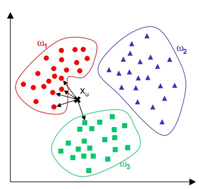

# K近邻(k-NearestNeighbor)
K最近邻(k-Nearest Neighbor，KNN)分类算法，是一个理论上比较成熟的方法，也是最简单的机器学习算法之一。该方法的思路是：如果一个样本在特征空间中的k个最相似(即特征空间中最邻近)的样本中的大多数属于某一个类别，则该样本也属于这个类别。KNN算法中，所选择的邻居都是已经正确分类的对象。该方法在定类决策上只依据最邻近的一个或者几个样本的类别来决定待分样本所属的类别。 KNN方法虽然从原理上也依赖于极限定理，但在类别决策时，只与极少量的相邻样本有关。由于KNN方法主要靠周围有限的邻近的样本，而不是靠判别类域的方法来确定所属类别的，因此对于类域的交叉或重叠较多的待分样本集来说，KNN方法较其他方法更为适合。    
## 例子（电影分类）
现在我们的任务是利用 knn 给最后一条记录进行分类

|电影名称 |	打斗次数|	接吻次数|	电影类型|
| -------- | ---------- | ----- | --- |
|California Man  |3	|104|	Romance|
|He’s Not Really into Dudes |2|	100	|Romance|
| Beautiful Woman | 1	|81	|Romance |
|Kevin Longblade |101|	10	|Action |
|Robo Slayer 3000 |99|	5|	Action |
|Amped II |98	|2	|Action|
|未知	|18	|90	|Unknown|

### 算法步骤
对未知类别属性对数据集中对每个点依次执行以下操作：  
（1）计算已知类别数据集中对点与当前点之间对距离；  
（2）按照距离递增次序排序；  
（3）选取与当前点距离最小对 k 个点；  
（4）确定前 k 个点所在类别出现频率；  
（5）返回前 k 个点出现频率最高对类别作为当前点对预测分类。  

K-NN计算点和点之间对距离,下图可帮助理解：  

