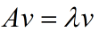
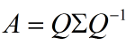
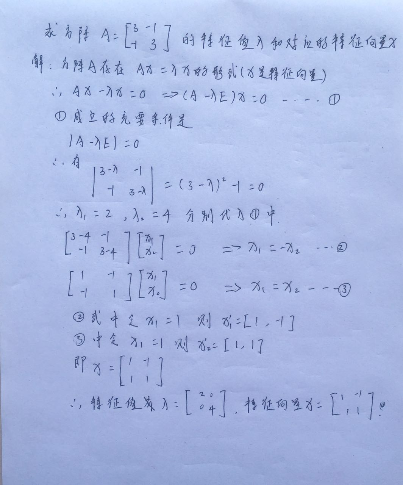
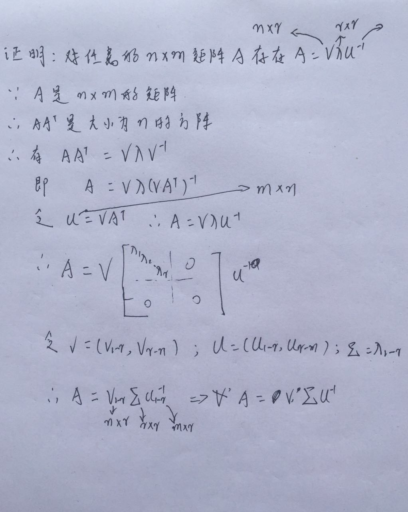

## 特征值分解

* 向量v是方阵A的特征向量，将一定可以表示成下面的形式
* 
* 其中λ表示的是特征值 v表示的是特征向量
* 所以对任意大小为n的方阵A都可以分解成这种形式，其中Q是大小为n的正交矩阵，λ是大小为n的对角矩阵 
* 
* 面是特征值和特征向量点求解方法

##  奇异值分解
* 奇异值分解（Singular Value Decomposition）A＝SVD
* 下面是证明对任意的m*n矩阵都可以分解成一个 大小为n*r的S矩阵，和一个r*r的对角矩阵V，及m*r的D矩阵，即A＝SVD

###  SVD求解步骤
    1 求AA'的特征值V和特征向量S,即AA'＝SVS'
    2 左右乘以A'^1，AA'A^1＝SVS'A^1 即 A＝SVS'A^1
    3 另D＝S'A^1，所以A＝SVD

