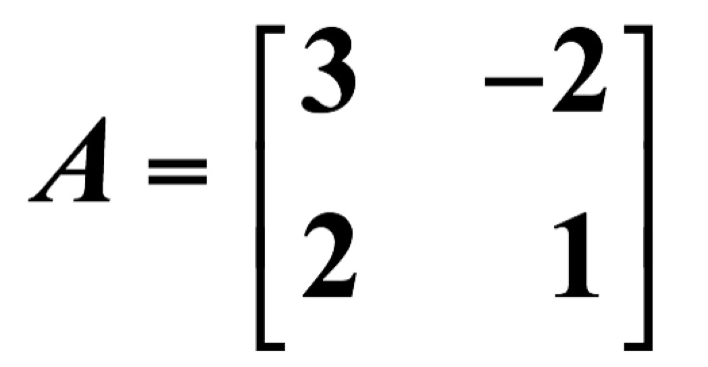
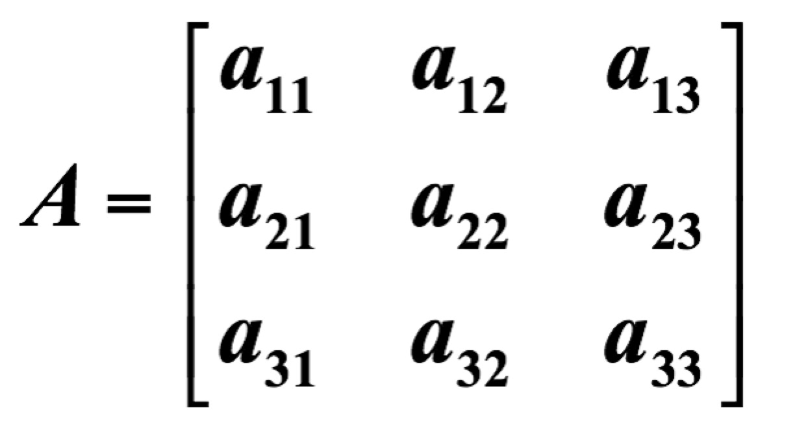
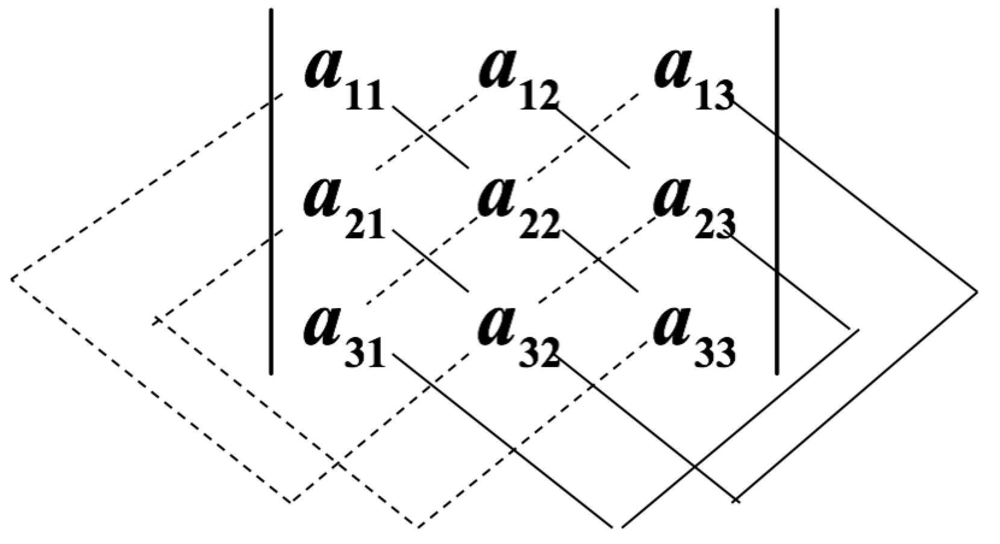
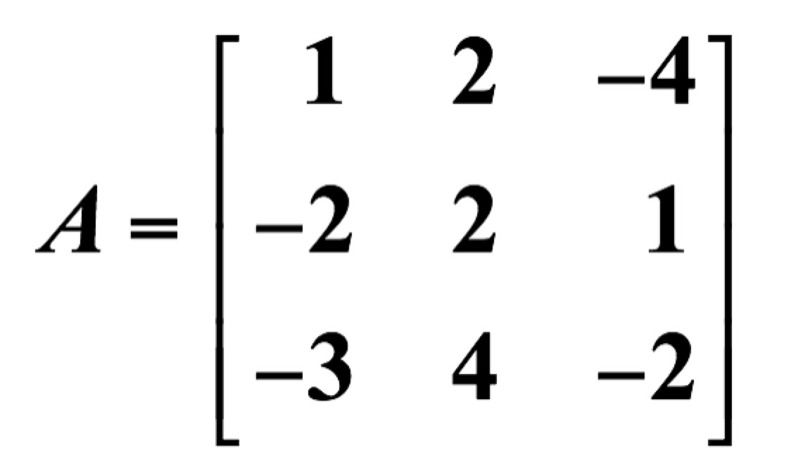
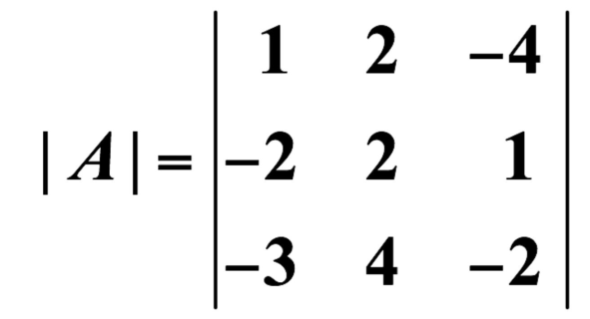
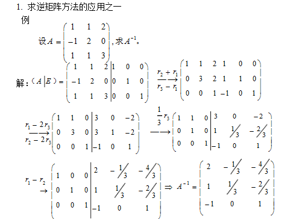
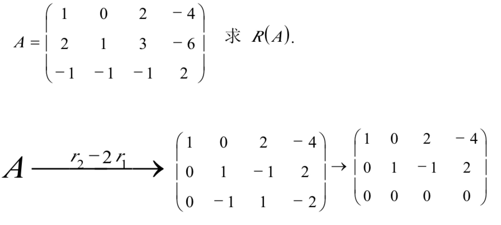

# 矩阵基础
## 什么是矩阵
1.  矩阵是一组向量，每个向量代表对客观事物多个方面对观察值
2.  矩阵是一个线性变换，它可以将一个向量变换成另一个向量

## 行列式
* 行列式是关于方阵的元素所定义的一种运算，其运算的结果是方阵的行列式值，简称行列式,方阵A的行列式表示成｜A｜
* 二阶方阵A行列式的求法

    

     实线连接的元素的乘积减去虚线连接的元素的乘积

    

    

* 求二阶方阵A的例子

    

    
* 三阶方阵A的求法

    

    实线连接的元素的乘积减去虚线连接的元素的乘积

    

* 求三阶方阵A的例子

    

    

    

## 矩阵的迹
* 设有N阶矩阵A，那么矩阵A的迹（用tr（A）表示）就等于A的特征值的总和，也即A矩阵的主对角线元素的总和

## 矩阵的逆
* 一个n阶方阵A称为可逆的，或非奇异的，如果存在一个n阶方阵B，使得AB=BA=E
并称B是A的一个逆矩阵。不可逆的矩阵称为奇异矩阵。A的逆矩阵记作A-1

## 特征值和特征向量
* 定义 设A是n阶方阵，如果数λ和n维非零列向量x使关系式
Ax=λx (1)
成立，那么这样的数λ称为矩阵A特征值，非零向量x称为A的对应于特征值λ的特征向量
* <a href="svd证明.md">具体求法参考svd证明.md</a>

## 矩阵转置

行列交换

## 矩阵的秩
  求矩阵A的秩方法：  
  1）利用初等行变换化矩阵A为阶梯形矩阵B  
  2）数阶梯形矩阵B非零行的行数即为矩阵A的秩

  

## 非奇异矩阵
* n 阶方阵 A 是非奇异方阵的充要条件是 A 为可逆矩阵，也即A的行列式不为零。 即矩阵（方阵）A可逆与矩阵A非奇异是等价的概念。
