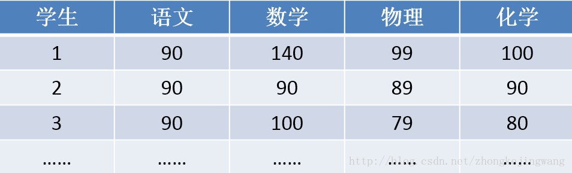

# PCA（Principal Component Analysis) 主成分分析
## 降维的必要性
* 多维度变量之间存在相互关系，导致分析复杂性增大
* 维度越高数据就越稀疏，低维度更接近正态分布

### 算法介绍
    pca把n维特征经过线性变换成m维，新特征是旧特征的线性组合，这些线性组合最大化样本方差，尽量使新的m个特征互不相关

### 例子
    下面是一些学生的成绩：

    假设各科成绩互不相关，那么很明显数学是第一主成分（可以明显拉开成绩｜方差最大），接下去是化学，语文基本是没影响所以分析成绩可以不考虑语文

    接下去看下面这个例子

    这份成绩就有点凌乱，很难找出主成分，接下去我们就介绍pca理论如何进行主成分分析

### PCA算法步骤
* 1计算样本间的协方差，因为方差越大越可以代表数据

  样本X和样本Y的协方差(Covariance)

    

> 协方差之间具体的意义（两个随机变量 X 与 Y 之间相互关系）：  
当 cov(X, Y)>0时，表明 X与Y 正相关；  
当 cov(X, Y)<0时，表明X与Y负相关；  
当 cov(X, Y)=0时，表明X与Y不相关。

* 2 构建方差矩阵

    当样本大小为n时，它们之间的方差是一个大小为n的方阵

    

* 3 根据公式求出特征值，还有特征向量

    

    那么我们就可以根据特征值的大小给特征向量进行排序，因为特征值表示的就是特征向量经过协方差矩阵线性变换后的贡献率，方差越大特征值也就越大。
    所以我们取特征值较大的k维向量就是降维了，然后利用这份新数据进行分析 算法复杂度就降低很多了。

* 参考文档
    http://blog.sina.cn/dpool/blog/s/blog_3f738ee00102vakz.html?vt=4
    http://www.cnblogs.com/zhangchaoyang/articles/2222048.html
