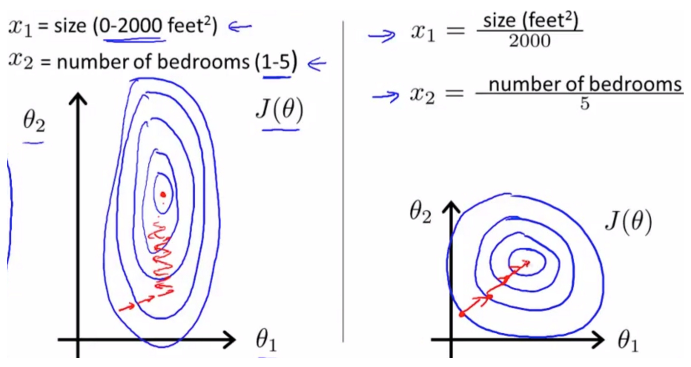
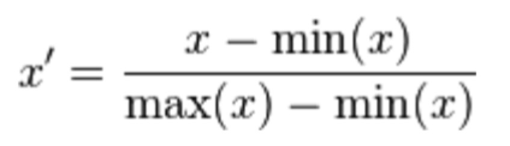
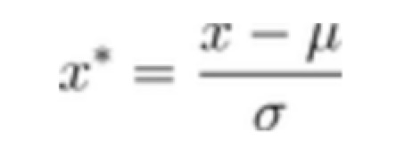

# 数据的归一化和标准化
 斯坦福机器学习视频对归一化的解释：https://class.coursera.org/ml-003/lecture/21

## 优点一 提供算法的收敛速度
以梯度下降法为例，下图蓝色的圈圈图代表的是两个特征的等高线。其中左图两个特征X1和X2的区间相差非常大，X1区间是[0,2000]，X2区间是[1,5]，其所形成的等高线非常尖。当使用梯度下降法寻求最优解时，很有可能走“之字型”路线（垂直等高线走），从而导致需要迭代很多次才能收敛；
而右图对两个原始特征进行了归一化，其对应的等高线显得很圆，在梯度下降进行求解时能较快的收敛。
因此如果机器学习模型使用梯度下降法求最优解时，归一化往往非常有必要，否则很难收敛甚至不能收敛。

## 优点二 提高算法的准确率

因为不同的特征属性有不同的度量单位，所以数据标准化后可以消除因为度量单位的不同造成的影响

## 常用的数据标准化处理
### 一、min-max标准化（Min-Max Normalization）
也称为离差标准化，是对原始数据的线性变换，使结果值映射到[0 - 1]之间。转换函数如下：

其中max为样本数据的最大值，min为样本数据的最小值。这种方法有个缺陷就是当有新数据加入时，可能导致max和min的变化，需要重新定义。

### 二、Z-score标准化方法
这种方法给予原始数据的均值（mean）和标准差（standard deviation）进行数据的标准化。经过处理的数据符合标准正态分布，即均值为0，标准差为1，转化函数为：

其中μ为所有样本数据的均值，σ为所有样本数据的标准差。该方法就是我们把正态分布曲线变换为标准正态分布的过程。
