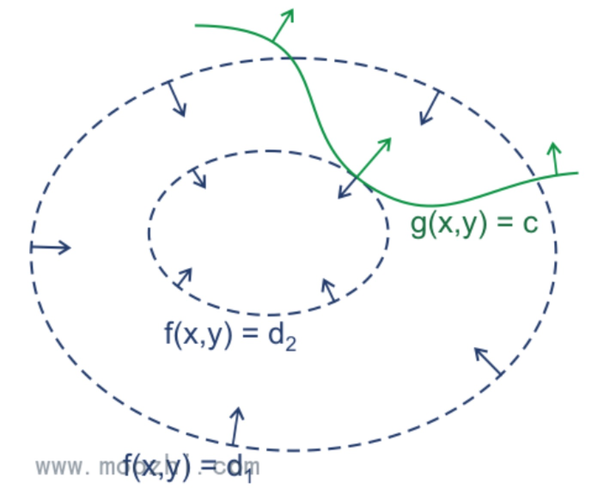
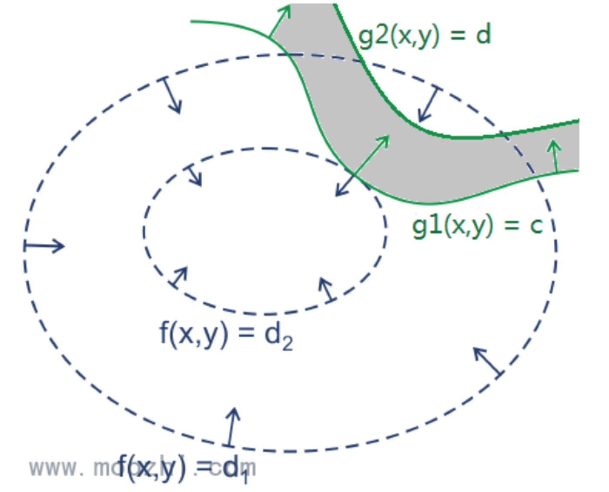

# 拉格朗日乘子法（Lagrange Multiplier)与KKT条件
在求取有约束条件的优化问题时，拉格朗日乘子法（Lagrange Multiplier) 和KKT条件是非常重要的两个求取方法，对于等式约束的优化问题，可以应用拉格朗日乘子法去求取最优值；如果含有不等式约束，可以应用KKT条件去求取。当然，这两个方法求得的结果只是必要条件，只有当是凸函数的情况下，才能保证是充分必要条件。KKT条件是拉格朗日乘子法的泛化

## 拉格朗日乘子法（Lagrange Multiplier) 和KKT条件
#### (i) 无约束优化问题，可以写为:

min f(x);  

如果是凸函数那么可以另导数为零求出最值

#### (ii) 有等式约束的优化问题，可以写为:

  min L(a, x) = f(x) + a*h(x),

拉格朗日乘子法（Lagrange Multiplier) ，即把等式约束h(x)用一个系数与f(x)写为一个式子，称为拉格朗日函数，而系数a称为拉格朗日乘子。通过拉格朗日函数对各个变量求偏导，令其为零，可以求得候选值集合，然后验证求得最优值
* 具体求法如下  
对L(a, x)求偏导  
∂L/∂x=0  
∂L/∂a=0  
求出a, x的值，代入即可得到目标函数的极值

#### (iii) 有不等式约束的优化问题，可以写为：

  min L(a, b, x)= f(x) + a*g(x)+b*h(x)

  把所有的等式、不等式约束与f(x)写为一个式子，也叫拉格朗日函数，系数也称拉格朗日乘子，通过一些条件，可以求出最优值的必要条件，这个条件称为KKT条件。
## 等式约束的拉格朗日乘子法
目标函数z = f(x), x是向量, z取不同的值，相当于可以投影在x构成的平面（曲面）上，即成为等高线，如下图，目标函数是f(x, y)，这里x是标量，虚线是等高线，现在假设我们的约束g(x)=0，x是向量，在x构成的平面或者曲面上是一条曲线，假设g(x)与等高线相交，交点就是同时满足等式约束条件和目标函数的可行域的值，但肯定不是最优值，因为相交意味着肯定还存在其它的等高线在该条等高线的内部或者外部，使得新的等高线与目标函数的交点的值更大或者更小，只有到等高线与目标函数的曲线相切的时候，可能取得最优值

## 含有不等约束的情况
和之前的不同之处在于：约束决定的可行区域由一条直线变成了一段带状区域。这个带状区域由两条边界 g ( x , y ) = c 和 g ( x , y ) = d 来决定

> 参考文档 http://www.tuicool.com/m/articles/uQnYZnn  
参考文档2 http://blog.csdn.net/xianlingmao/article/details/7919597
