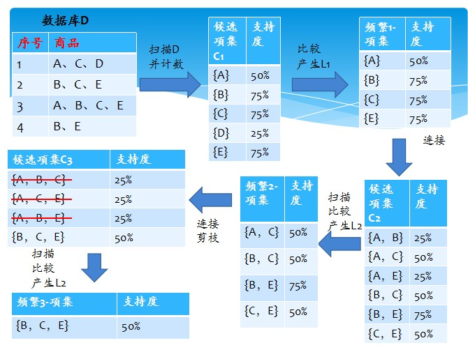

# Apriori 算法详解
关联规则是从数据背后发现事物之间可能存在的关联或者联系然后通过支持度和信任度分别满足用户给定阈值的规则。Apriori算法是一种挖掘关联规则的频繁项集算法,它的一个经典案例就是“啤酒和尿布”
## 一、基本概念
对于A->B  
***①支持度*** ：P(A ∩ B)，既有A又有B的概率  
***②置信度*** ：  
P(B|A)，在A发生的事件中同时发生B的概率  
p(AB)/P(A)     例如购物篮分析：啤酒 ⇒ 尿布  
例子：[支持度：3%，置信度：40%]  
支持度3%：意味着3%顾客同时购买啤酒和尿布  
置信度40%：意味着购买啤酒的顾客40%也购买尿布

## 二、Apriori定律
Apriori定律：如果一个集合是频繁项集，则它的所有子集都是频繁项集。举例：假设一个集合{A,B}是频繁项集，即A、B同时出现在一条记录的次数大于等于最小支持度min_support，则它的子集{A},{B}出现次数必定大于等于min_support，即它的子集都是频繁项集。

## 三、实现步骤
Apriori使用一种称作逐层搜索的迭代方法，“K-1项集”用于搜索“K项集”。  
首先跟进用户设置的支持度阀值，找出频繁“1项集”的集合，该集合记作L1。L1用于找频繁“2项集”的集合L2，而L2用于找L3。如此下去，直到不能找到“K项集”。找每个Lk都需要一次数据库扫描。如下图：  

